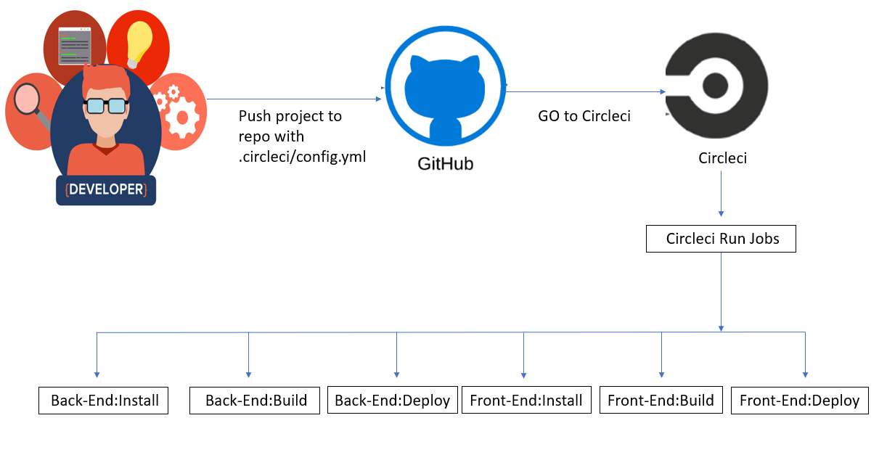

## Udagram Pipeline



Configuration of CircleCI are got from `.circleci/config.yml`

#

## CircleCI do theses things

## API

- **Back-End Installation**:

  ```
   npm run backend:install
  ```

- **Back-End Build**:

  ```
   npm run backend:build
  ```

- **Back-End Deploy**:

  ```
   npm run backend:deploy
  ```

#

## FRONT-END

- **Front-End Install**:

  ```
  npm run frontend:install
  ```

- **Front-End Build**:

  ```
  npm run frontend:build
  ```

- **Front-End Deploy**:

```
npm run frontend:deploy
```
